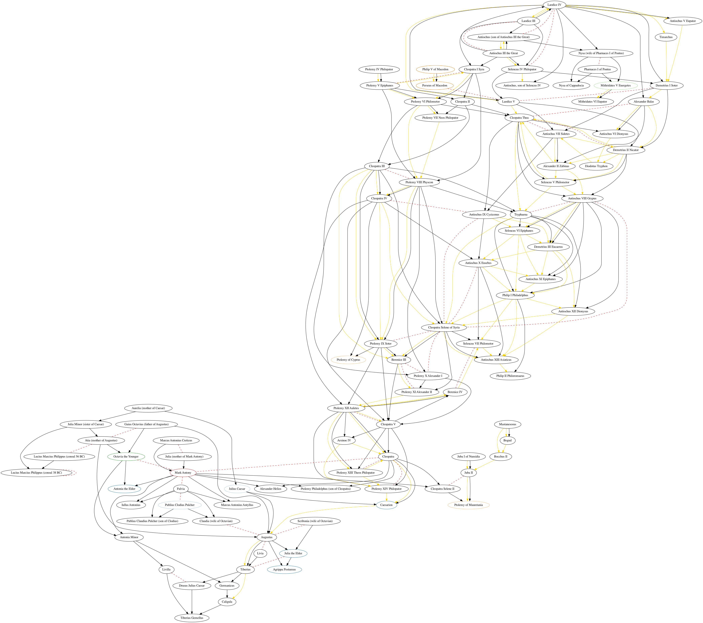
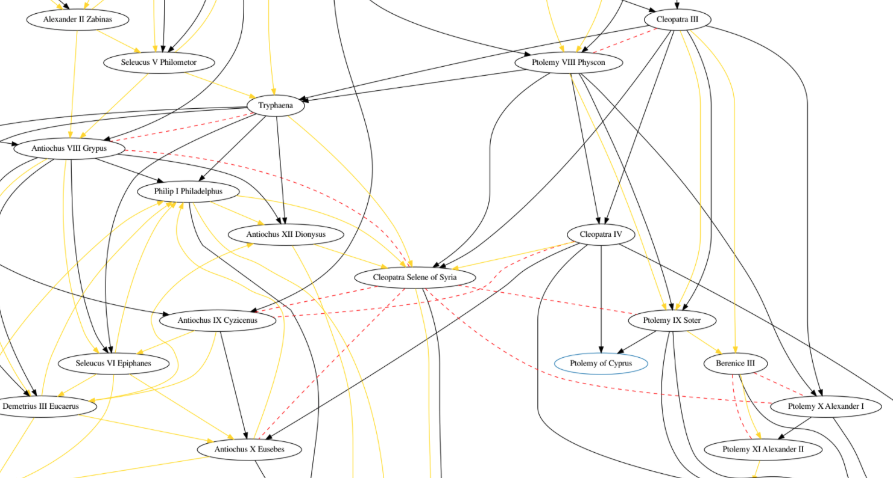
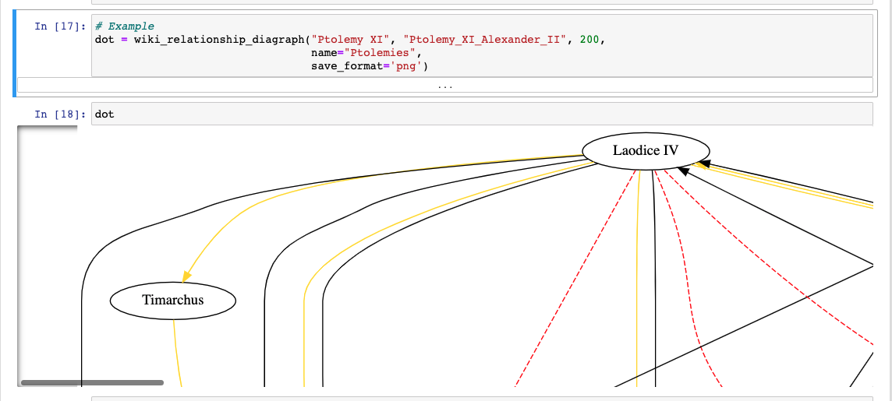

# Wikipedia Relationship Networks


Jupyter Notebook for finding quasi-incestuous relationships according to Wikipedia

Basically: choose a person who's available on wikipedia. Then use this program to get a dot diagraph of their family relationships, and where they fall in any lines of succession for a title (eg, royal crown).


<hr>


### Quick Start

[](https://mybinder.org/v2/gh/HebeHH/WikipediaRelations/main?filepath=WikipediaRelations.ipynb)

This is meant to be generally accessible for anyone, regardless of whether you have any coding experience whatsoever. Just follow these instructions, and you'll be able to view the intensely complicated relationship webs of whoever you're interested in!


**Create the example Ptolemy diagram:**


1. Open the Jupyter Notebook in Binder by clicking on the badge, or [this link](https://mybinder.org/v2/gh/HebeHH/WikipediaRelations/main?filepath=WikipediaRelations.ipynb).
2. Along the top tools bar, you'll see a `fast-forward` button (looks similar to: `>>`). Click it.
3. On the popup, click the red `Restart and Run All Cells` option.
4. Scroll to the bottom and wait for the progress bar to complete. This may take several minutes.
5. Just below, you will see the diagram you just created!


**To then create your own diagram:**

1. Follow the previous steps.

2. In the QuickStart example, you will see that there are two variables set: `name` and `link`. Change the `link` to the Wikipedia link of the person you're isterested, and set `name` as the name you want to display. Like so:

   ```python
   # QuickStart Example 
   
   dot = wiki_relationship_diagraph(
       name = "That Bloody Womanizer", #  <- this is changed
       link = "https://en.wikipedia.org/wiki/Henry_VIII" # <- so is this
   )
   ```

3. Along the top bar, hit the 'Run' button. Wait a second, then hit it again. Twice total.

4. Wait until the progress bar is finished, then your results will be ready!


For more detail on how to run the code, see the  section `Running the Code: Detail`.


<hr>


### Example: Relationships of the Ancient Egypt Ptolemies

_Red dashed line is marriage. Gold arrow shows succession of a title. Black arrow is parent/child. Click for bigger image._




The graph is a bit messy, as auto generated ones usually are. But zooming in and tracing out the lines yields up a variety of interesting characters and complicated relationships. My favourite is [Cleopatra Selene of Syria](https://en.wikipedia.org/wiki/Cleopatra_Selene_of_Syria). This woman inherited four different titles, largely due to her five marriages:

- *Ptolemy IX:* her oldest brother.
- *Ptolemy X:* her other brother.
- *Antiochus VIII:* her maternal cousin, the widower of her sister Tryphaena.
- *Antiochus IX:* her maternal cousin, the widower of her sister Cleopatra IV, and the brother of her previous husband Antiochus VIII.
- *Antiochus X:* her step-son, who also happened to be her nephew.





<br>

<hr>


### How it works

**1.** _Scrape Wikipedia page_

After getting the Wikipedia HTML for the given person, use BeautifulSoup to localize the `infobox` section. You're probably already familiar with this - see the one for Obama below.


**2.** _Find relevant lines_

Go through the infobox table and pull out all lines where the title matches one of the keywords. Eg: `Succeeded by`.

**3.** _Add new people and relationships_

For each relevant line, find any links in the value. This doesn't pay much attention to the actual text; it just looks for links (`<a>` tags) and gets the reference. These links represent a new `Person`, and are added to the queue. The relationship information is added to the current `Person` object; that they have _this relationship_ (from keyword) to _this person_ (from link).

**4.** _Repeat_

Go through the above steps for all the new related people who's links have been found. This isn't done infinitely, it's only done for `count` number of people.

**5.** _Create graph_

At this point there's a list of _People_ objects, each containing their own relationships. This is transformed into a nodelist/edgelist graph structure. 

**6.** _Prune_

Remove 'unimportant' people from the graph, ie: people on the fringes without connections. This prunes all people with only one connection, and then recurses, until only highly-connected people are left. This step is optional: you can turn it off by setting `trim=False`.

**7.** _Draw graphic_

Use the [graphviz](https://graphviz.readthedocs.io/en/stable/manual.html) library to create the diagraph representation and save it.


<hr>


### Running the Code: Detail

[](https://mybinder.org/v2/gh/HebeHH/WikipediaRelations/main?filepath=WikipediaRelations.ipynb)

If you want to skip cloning the repo, you can use the online Binder notebook by clicking on the binder launch button above. Run all cells, then scroll down to the very bottom and see your output. It should look something like this:




**Basic usage:**

```python
dot = wiki_relationship_diagraph("Ptolemy XI", "Ptolemy_XI_Alexander_II")
```
Call the `wiki_relationship_diagraph` function and pass it 1) the name of the starting person, and 2) their Wikipedia link.

This will create the relationship diagram for that person. For example, the previous command will create the graph given above. See it in more detail [here](https://raw.githubusercontent.com/HebeHH/WikipediaRelations/main/Ptolemies.png).


**Full function and with default paramaters:**
```python
wiki_relationship_diagraph(name, link, count=150,
                           title="WikiRelations", 
                           trim=True, save=True, 
                           save_format=False)
```

These paramaters are:
- `name`: Display name of starter person
- `link`: The Wikipedia link for that person (or at least the last step in the url path)
- `count`: How many related people to try and pull
- `title`: Name to save the dot graph as
- `trim`: Recursively remove all 'dead ends' that don't go much of anywhere (I was interested in finding cyclic connections)
- `save`: Whether to save the graph to disk or not.
- `save_format`: Format to save the graph as. `False` means it will use your computer's default value. Otherwise, give a format value as a string from this list of what's available: https://www.graphviz.org/doc/info/output.html


<br>

<hr>


### Important Notes

Be aware:
- Will take awhile as we're scraping each wikipedia page individually. No parallelism yet.
- There's no guarantee that the program will actually find the interesting relationships.
- All titles are represented the same way (with the gold arrow). There's usually several different titles represented on the same graph, because titles are nepotistic like that. You'll need to google to work it out.

Known bugs:
- The relation shown is always with the _link_ given in the Wikipedia section, not the name. Sometimes this doesn't match. Eg: the spouse section on [Demetrius I of Bactria's](https://en.wikipedia.org/wiki/Demetrius_I_of_Bactria) Wikipedia page links to a secondary person (eg: "Daughter of Daughter of Daughter of [Antiochus III](https://en.wikipedia.org/wiki/Antiochus_III_the_Great). In the graph above, you can see it's showing a marriage link between Demetius and Antiochus instead.
